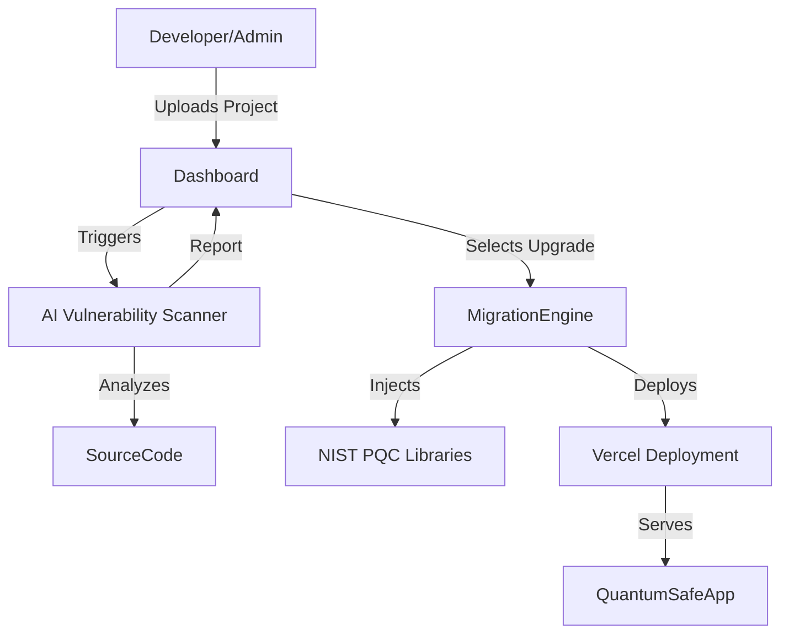

# Solution Design: Quantum Resilience Toolkit

## Overview
The Quantum Resilience Toolkit is a comprehensive platform facilitating the transition to Post-Quantum Cryptography (PQC). It abstracts the complexities of lattice-based cryptography behind intuitive APIs and dashboards.

## Core Components

### 1. AI-Based Vulnerability Scanner
*   **Function**: Scans source code (GitHub/GitLab integrations) and API endpoints.
*   **Mechanism**: Uses fine-tuned Hugging Face transformer models to identify usages of RSA, ECDSA, DH, and other vulnerable primitives.
*   **Output**: A risk score report highlighting "Quantum-Critical" code blocks.

### 2. Migration Assistant
*   **Function**: Suggests and helps implement drop-in replacements.
*   **Standards**: Supports NIST-finalized algorithms:
    *   **Key Encapsulation**: CRYSTALS-Kyber (ML-KEM)
    *   **Digital Signatures**: CRYSTALS-Dilithium (ML-DSA), FALCON, SPHINCS+
*   **Automation**: Generates refactored code snippets or wrapper classes that utilize PQC libraries (prominently `liboqs` bindings).

### 3. No-Code / Low-Code Dashboard
*   **Visual Interface**: Drag-and-drop interface for configuring security policies.
*   **API Gateway**: A managed proxy that automatically upgrades incoming connections to quantum-safe TLS where supported (Hybrid mode).
*   **One-Click Redeploy**: Integrated with Vercel to redeploy static sites and serverless functions with upgraded security headers and libraries.

## Architecture

